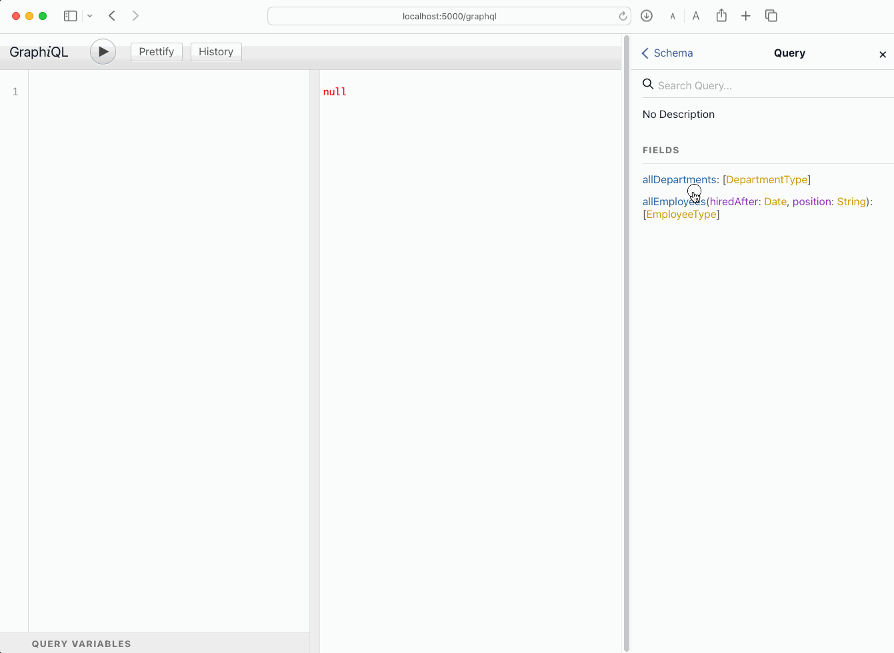

Example of using GraphQL with InterSystems IRIS with Graphene, SQLAlchemy and Flask.

# What are the goals of this example?
* Create a sample `Employee`, `Department` data model in InterSystems IRIS
* Implement a GraphQL server to query and modify data

# What do you need to install? 
* [Git](https://git-scm.com/downloads) 
* [Docker](https://www.docker.com/products/docker-desktop) (if you are using Windows, make sure you set your Docker installation to use "Linux containers").
* [Visual Studio Code](https://code.visualstudio.com/download) + [InterSystems ObjectScript Extension Pack](https://marketplace.visualstudio.com/items?itemName=intersystems-community.objectscript-pack)
* [Python](https://www.python.org/downloads/)

# Setup
Run an InterSystems IRIS Community edition instance:
```bash
docker compose build
docker compose up -d
```

Create a Python virtual environment for this project:
```bash
# create a local venv environment
python3 -m venv .venv

# activate venv
source .venv/bin/activate

# install dependencies
pip3 install -r requirements.txt
```

# Create some sample data
Open an interactive Python session and run a method to initialize your data model and insert some data.

```bash
cd graphql-server
python
```

```python
from models import db_session, engine, Base, Department, Employee
# create tables
Base.metadata.create_all(bind=engine)
# create some data
from app import init_data
init_data()
```

# Run GraphQL server
There is a GraphQL server implementation ready for you to test:
* [graphql-server/models.py](./graphql-server/models.py) - defines the database schema. It includes the models for `Employee` and `Department`.
* [graphql-server/schema.py](./graphql-server/schema.py) - GraphQL schema definition using Graphene. It includes queries and mutations for creating data. 
* [graphql-server/schema-relay.py](./graphql-server/schema.py) - Another GraphQL schema definition using Graphene but using a [relay](https://docs.graphene-python.org/en/latest/relay/) approach that supports pagination.
* [graphql-server/app.py](./graphql-server/app.py) - sets up the Flask application and `/graphql` and `/graphql-relay` endpoints for both schemas (relay and not relay).

```bash
cd graphql-server
python app.py
```

# Test your GraphQL implementation
You can import [collection_iris-graphql-demo.json](./collection_iris-graphql-demo.json) in Postman or [ThunderClient for VS Code](https://www.thunderclient.com) and check the output.

There is also a GraphiQL UI available at http://localhost:5000/graphql



